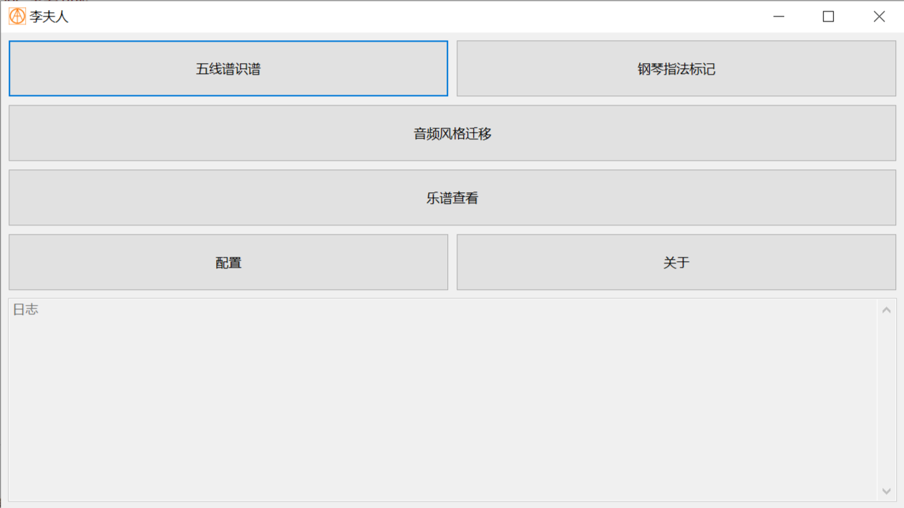

# 李夫人

```
北方有佳人，绝世而独立。
一顾倾人城，再顾倾人国。
宁不知倾城与倾国，佳人难再得。
```

**学习`AI`相关知识，搞点东西练手。**

----

<p align="center">
    <a target="_blank" href="https://starchart.cc/acgist/lifuren">
        
    </a>
    
    <br />
    
    
    
    
</p>

## 模块

|模块|名称|详细描述|
|:--|:--|:--|
|docs|项目文档|项目文档|
|deps|依赖项目|依赖项目|
|core|核心模块|模型训练、模型推理|
|client|接口模块|`CLI`接口、`GUI`接口|

## 结构

```
+-+-+-+-+-+-+-+-+-+-+-+-+-+-+-+-+-+-+-+-+-+-+-+-+-+-+-+-+-+-+-+-+
|       |                         client                        |
|       +-+-+-+-+-+-+-+-+-+-+-+-+-+-+-+-+-+-+-+-+-+-+-+-+-+-+-+-+
|       |           CLI             |           GUI             |
| C/C++ +-+-+-+-+-+-+-+-+-+-+-+-+-+-+-+-+-+-+-+-+-+-+-+-+-+-+-+-+
|       |                          core                         |
|       +-+-+-+-+-+-+-+-+-+-+-+-+-+-+-+-+-+-+-+-+-+-+-+-+-+-+-+-+
|       |      spdlog     |      opencv      |     libtorch     |
+-+-+-+-+-+-+-+-+-+-+-+-+-+-+-+-+-+-+-+-+-+-+-+-+-+-+-+-+-+-+-+-+
```

## 文档

* [学习资料](./docs/AI.md)
* [计划文档](./docs/TODO.md)
* [部署文档](./docs/Deploy.md)

## 功能

|任务|当前状态|详细描述|
|:--|:--:|:--|
|吴道子|√|视频生成|
|`CLI`接口|√|命令行接口|
|`GUI`接口|√|图形化接口|
|模型部署|?|`OpenVINO`/`OnnxRuntime`|

*√ - 完成、○ - 实现、# - 等待、? - 待定、~ - 忽略*

## CLI

```
./lifuren[.exe] 命令 [参数...]
./lifuren[.exe] train model_path dataset
./lifuren[.exe] image model_file image_path
./lifuren[.exe] video model_file image_file
./lifuren[.exe] [?|help]
```

## GUI


